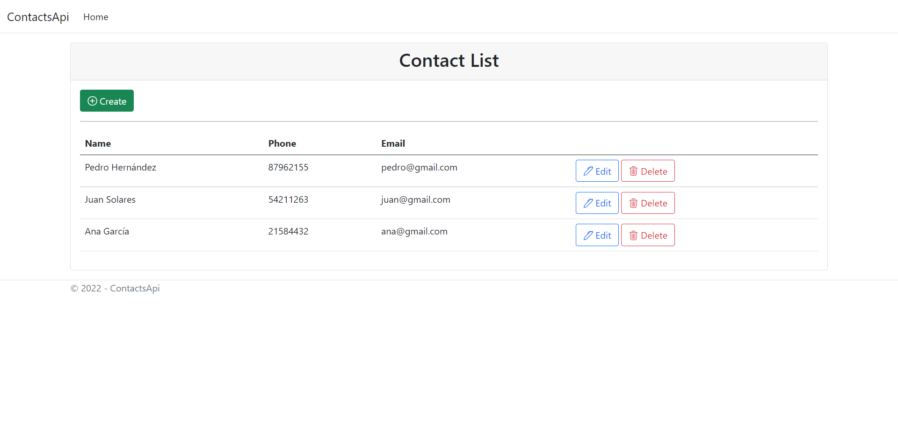
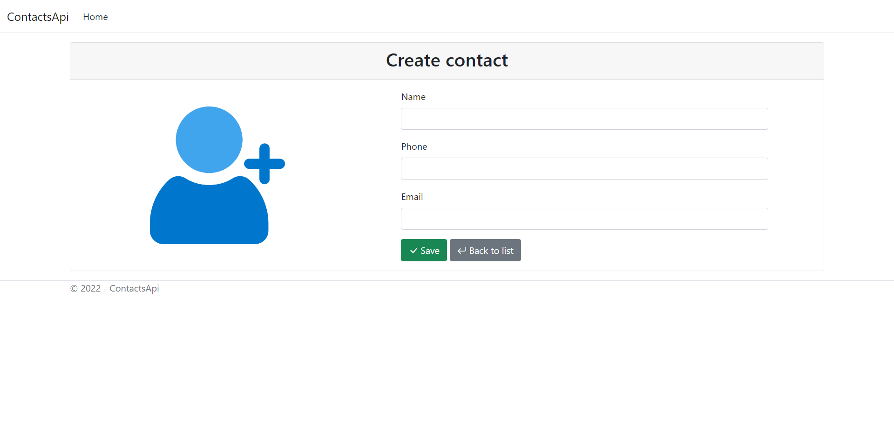
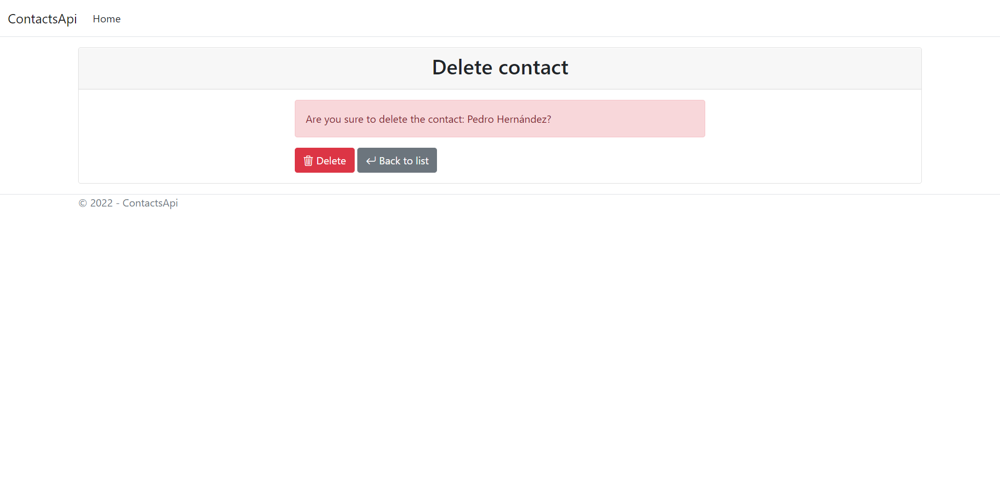
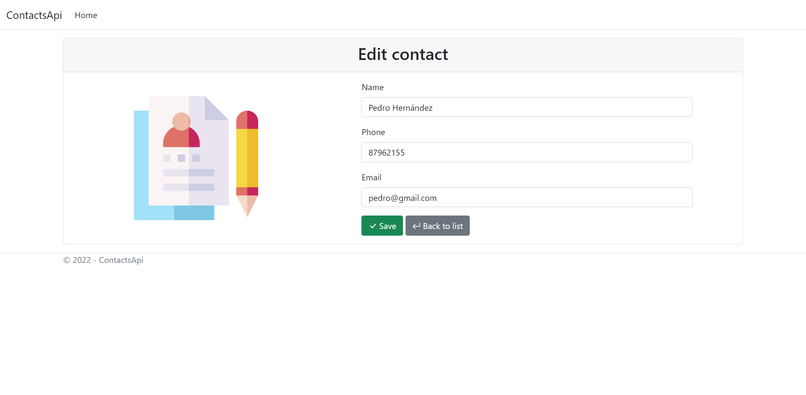

# Contacts api

## Project type

## Complements

<table>
<thead>
  <tr>
    <th>Name</th>
    <th>Version</th>
    <th>Description</th>
  </tr>
</thead>
<tbody>
  <tr>
    <td>System.Data.SqlClient</td>
    <td>Latest stable 4.8.5</td>
    <td>Is the ADO.NET provider you use to access SQL Server or Azure SQL Databases.</td>
  </tr>
</tbody>
</table>

## App

### Contact list

### Create contact

### Delete contact

### Edit contact

